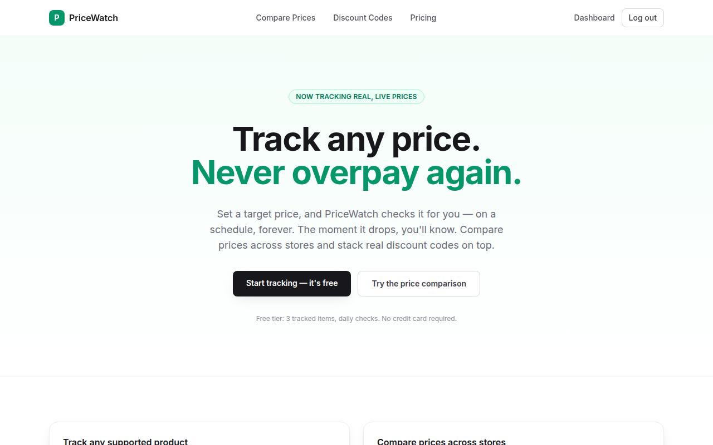
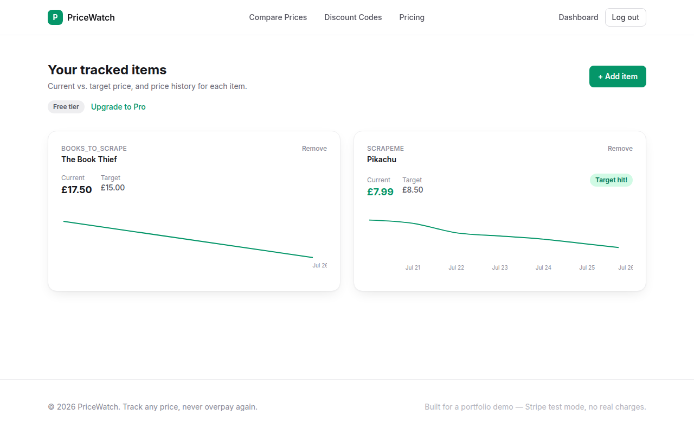
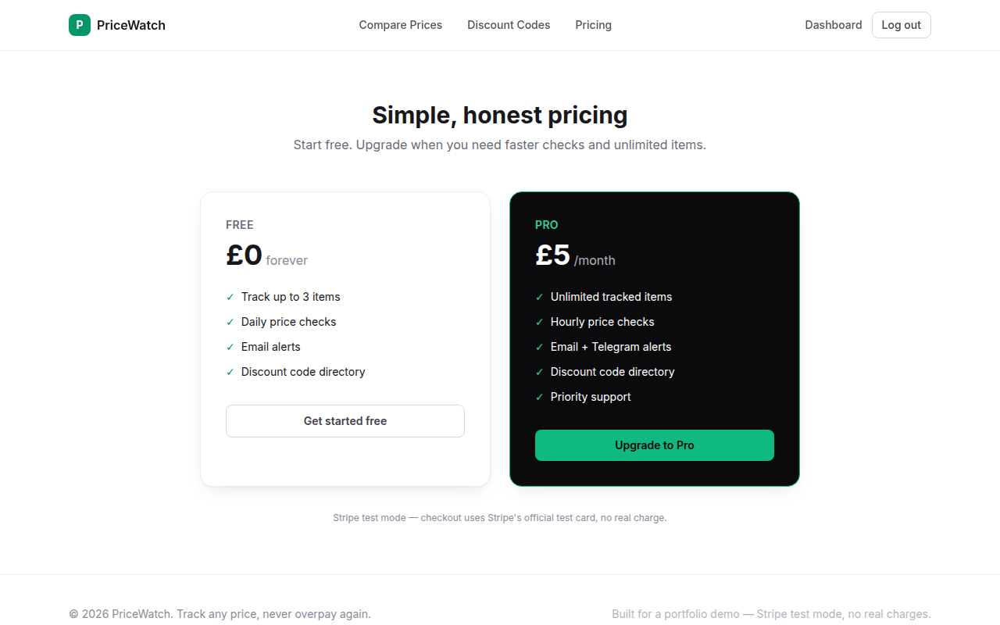
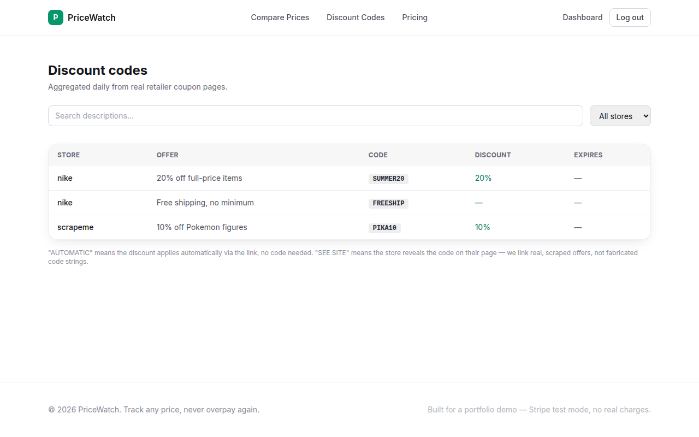

# PriceWatch

**Track any price. Never overpay again.**

Set a target price on a product and PriceWatch checks it for you on a
schedule — the moment it drops, you know. Compare prices across stores
and browse a directory of real, scraped discount codes on top.

Built as a portfolio demo — Stripe billing runs in test mode, no real
charges.



## Screenshots

<table>
<tr>
<td width="50%">

**Dashboard** — live price history per item, target-hit badges



</td>
<td width="50%">

**Pricing** — Free vs. Pro tiers, Stripe Checkout



</td>
</tr>
</table>

**Discount codes** — aggregated daily from real retailer coupon pages



## How it works

1. Sign up, paste a product URL from a supported store, set a target price.
2. A background worker (`workers/scheduler.py`) checks the price on a
   schedule — daily on the Free tier, hourly on Pro — and records every
   check to price history.
3. When the price hits your target, you get an alert (email, or
   Telegram on Pro) with a cooldown so you're not spammed.
4. Upgrading to Pro goes through real Stripe Checkout (test mode); a
   webhook flips your account's tier and a customer-portal link lets
   you manage or cancel the subscription.

## Stack

- **Backend**: FastAPI + SQLAlchemy (Postgres), JWT auth, Stripe billing
- **Frontend**: Next.js (pages router) + Tailwind
- **Workers**: APScheduler background process for price checks, alerts, and discount-code scraping
- **Infra**: Postgres + Redis, orchestrated via `docker-compose.yml`

## Features

- Email/password auth (JWT)
- Track items across supported stores ([`scrapers/registry.py`](scrapers/registry.py) lists them), with price history and target-price alerts
- Free tier: 3 items, daily checks. Pro tier (Stripe subscription, £5/mo): unlimited items, hourly checks
- Discount code directory, scraped periodically
- Cross-store price comparison search

## Running locally

```bash
cp .env.example .env   # fill in a JWT secret; Stripe keys are optional (billing degrades gracefully without them)
docker compose up --build
```

- API: http://localhost:8000 (docs at `/docs`)
- Frontend: http://localhost:3000

Or run each piece directly:

```bash
# Backend
pip install -r requirements.txt
uvicorn backend.main:app --reload

# Frontend
cd frontend && npm install && npm run dev

# Background worker (price checks, alerts, discount scraping)
python -m workers.scheduler
```

## Tests

```bash
pytest
```

Stripe calls are monkeypatched in tests — no network calls or real API keys required.
